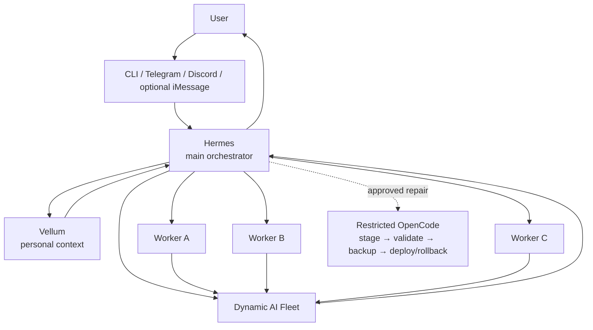

<h1 align="center">☁️ Open Cloud Assistant</h1>

<p align="center"><strong>A free-first, self-hosted, always-on personal AI assistant stack for Ubuntu.</strong></p>

<p align="center">
  <a href="https://github.com/Mukeshkr-19/OpenCloudAssistant/releases"></a>
  <a href="LICENSE"></a>
  
  
  
</p>

<p align="center"><strong>Hermes orchestration · Vellum personal context · dynamic AI routing · parallel workers · restricted self-repair</strong></p>

> [!IMPORTANT]
> **v0.1.0 is a prerelease.** The Ubuntu 24.04 ARM64 installation path and CLI workflow have been validated. Telegram and Discord configuration are included but still need public end-to-end acceptance testing before a stable v1.0. Browser/Open WebUI is preview-only in this release. iMessage is optional.

## What it is

Open Cloud Assistant turns an Ubuntu server into an assistant that can stay online, route model calls across changing free-capacity providers, retrieve personal context through a separate memory layer, split complex work across temporary parallel workers, and recover from selected code defects through a restricted repair workflow.

The architecture deliberately separates responsibilities:

- **Hermes** is the user-facing orchestrator: conversation, tools, planning, workers, messaging, and final synthesis.
- **Vellum** is the personal-context layer: user-specific memory is kept outside the public source repository.
- **Fleet** chooses currently usable provider/model capacity at runtime instead of permanently hard-coding temporary model IDs.
- **Workers** are temporary child jobs for one complex task, not permanent specialist personalities.
- **OpenCode repair** can edit a staged copy under restricted permissions; a trusted outer harness validates, backs up, deploys, or rolls back.



## Release status

| Area | v0.1.0 status |
|---|---|
| Ubuntu 24.04 ARM64 install | ✅ Release-validated |
| Second install / idempotency | ✅ Validated |
| CLI installation and diagnostics | ✅ Validated |
| Dynamic NVIDIA discovery | ✅ Implemented |
| OpenRouter `openrouter/free` fallback | ✅ Implemented |
| Vellum context bridge | ✅ Implemented |
| Parallel workers | ✅ Implemented, up to 3 concurrent children |
| Restricted self-repair | ✅ Smoke-tested |
| Telegram setup | 🧪 Configuration implemented; public E2E pending |
| Discord setup | 🧪 Configuration implemented; public E2E pending |
| Browser / Open WebUI | ⚠️ Preview; E2E runtime not release-validated |
| iMessage / Apple | ➕ Optional; never required |
| Ubuntu x86_64 | 🧪 Accepted by preflight; clean E2E proof still pending |

## Quick start on an Ubuntu server

Install the operating-system prerequisites:

```bash
sudo apt-get update
sudo apt-get install -y ca-certificates curl git xz-utils unzip python3 python3-venv python3-pip sudo dbus-user-session procps
```

Clone and validate before making changes:

```bash
git clone https://github.com/Mukeshkr-19/OpenCloudAssistant.git
cd OpenCloudAssistant
./setup.sh --dry-run
```

For the simplest first installation, start with CLI only:

```bash
OPEN_CLOUD_CHANNELS=cli ./setup.sh --install
```

Configure at least one usable AI provider. NVIDIA + OpenRouter is the recommended free-first combination:

```bash
./bin/opencloud providers configure
./bin/opencloud fleet refresh
./bin/opencloud fleet proof
./bin/opencloud doctor
```

Then start a CLI conversation:

```bash
export PATH="$HOME/.local/bin:$HOME/.bun/bin:$HOME/bin:$PATH"
hermes chat
```

> [!NOTE]
> In v0.1.0, the project command wrapper is guaranteed at `./bin/opencloud` while you are inside the repository. If `opencloud` is already on your `PATH`, you can omit `./bin/`.

## Add messaging later

You do not need Telegram, Discord, Apple hardware, or a browser UI to complete the core install. When you are ready:

```bash
./bin/opencloud channels configure
./bin/opencloud channels status
./bin/opencloud services install
./bin/opencloud doctor
```

Telegram is the recommended cross-platform messaging path. See [Channels](docs/CHANNELS.md) for BotFather setup, the explicit user allowlist, Discord setup, Browser preview status, and optional iMessage notes.

## Where configuration lives

Runtime secrets are intentionally outside Git:

| Purpose | Runtime location |
|---|---|
| Provider + channel secrets | `~/.opencloud/config.env` |
| Channel selection | `~/.opencloud/channels.json` |
| Fleet runtime | `~/.local/share/hermes-fleet/` |
| Hermes | `~/.hermes/` |
| Vellum | user runtime managed by Vellum |

Both Open Cloud Assistant config files are created with restrictive permissions. **Do not put real keys in `.env.example` or commit a runtime config file.**

## Documentation

Start here if this is your first cloud server:

| Guide | Use it for |
|---|---|
| **[Complete Setup Guide](docs/COMPLETE_SETUP_GUIDE.md)** | Zero → cloud VM → SSH → install → providers → channels → first conversation |
| **[Oracle Cloud Setup](docs/ORACLE_CLOUD_SETUP.md)** | Create an OCI Ubuntu ARM64 VM safely |
| **[Ubuntu / VPS Setup](docs/UBUNTU_VPS_SETUP.md)** | Use another Ubuntu 24.04 host |
| **[Providers](docs/PROVIDERS.md)** | NVIDIA, OpenRouter, optional Zen, Fleet refresh and verification |
| **[Channels](docs/CHANNELS.md)** | CLI, Telegram, Discord, Browser preview, optional iMessage |
| **[Architecture](docs/ARCHITECTURE.md)** | Hermes, Vellum, workers, Fleet, self-repair and privacy boundaries |
| **[Operations](docs/OPERATIONS.md)** | Health, services, logs, restarts, updates and maintenance |
| **[Troubleshooting](docs/TROUBLESHOOTING.md)** | Symptom → checks → fix |
| **[Documentation Index](docs/README.md)** | All project documentation |

Existing engineering references under `docs/` remain useful for implementation details such as Fleet internals, materialization, services, and self-repair.

## Provider policy

Permanent source policy does **not** pin changing NVIDIA or OpenCode Zen model IDs. Runtime discovery verifies currently available candidates. The stable explicit OpenRouter route is:

```text
openrouter/free
```

Gemini is intentionally blocked by the public routing integration until it is independently configured and verified. Free provider capacity, quotas, latency, and model availability are controlled by external providers and can change without a repository update.

## Security model

Open Cloud Assistant connects agents to real tools and personal context. Treat it like production infrastructure.

- Keep `~/.opencloud/config.env` private and mode `600`.
- Never commit API keys, bot tokens, private memory, conversations, auth state, runtime databases, or SSH keys.
- Do not expose the Hermes API port directly to the public internet. Browser preview configuration is localhost-only by design.
- The restricted coding agent does not receive Git push, broad shell, secret, or arbitrary filesystem access.
- Internal fallback and routine gateway lifecycle chatter are kept out of normal user conversations; the underlying recovery logic and logs remain active.

Read [SECURITY.md](SECURITY.md) before exposing any integration to the internet.

## Validation for contributors

```bash
./scripts/public-audit.sh
./tests/smoke/run.sh
```

The smoke suite covers public privacy checks, brain integration references, self-repair, Fleet runtime/discovery, Hermes↔Vellum integration, channels, services, live Hermes integration, and the install branch.

## Upstream projects

Open Cloud Assistant is an independent integration project built around upstream open-source components including **Hermes Agent**, **Vellum Assistant**, and **OpenCode**. Their licenses and notices remain their own. See [THIRD_PARTY_NOTICES.md](THIRD_PARTY_NOTICES.md) and `licenses/`.

## License

Original Open Cloud Assistant integration, deployment, and documentation work is released under the [MIT License](LICENSE). Third-party components remain governed by their own licenses.


## Automatic prerequisite bootstrap

`./setup.sh --install` checks the supported Ubuntu host and installs missing
base operating-system packages through `apt-get` only when they are required.

`./setup.sh --dry-run` never installs packages. Missing prerequisites are
reported as `WOULD_INSTALL` entries.

The bootstrap is intentionally limited to the small Ubuntu package set needed
by Open Cloud Assistant; Hermes, Vellum, OpenCode and provider credentials
remain handled by their dedicated installer stages.
