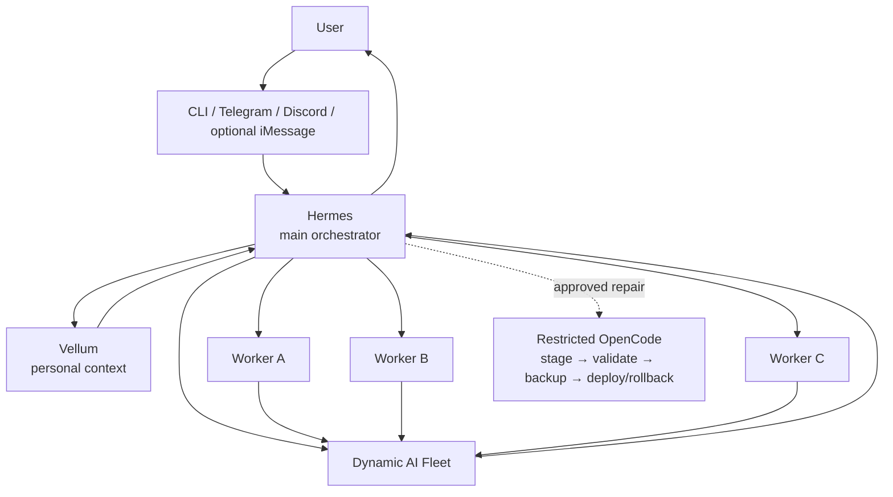

# ☁️ Open Cloud Assistant

**A free-first, self-hosted cloud AI assistant for Ubuntu.**

Hermes orchestration · Vellum personal context · dynamic model routing · bounded parallel workers · guarded self-repair

Open Cloud Assistant turns an Ubuntu server into an always-available assistant
that can route across changing free AI capacity, retrieve personal context,
split complex work across temporary workers, and recover safely from selected
code failures.

> [!NOTE]
> **Current release: v0.2.0.**
> Ubuntu 24.04 ARM64 has real clean-machine and idempotency validation.
> x86_64 has hosted CI/source compatibility validation; real-machine
> acceptance remains deferred. Browser integration remains preview.

## What it is

Open Cloud Assistant turns an Ubuntu server into an assistant that can stay online, route model calls across changing free-capacity providers, retrieve personal context through a separate memory layer, split complex work across temporary parallel workers, and recover from selected code defects through a restricted repair workflow.

The architecture deliberately separates responsibilities:

- **Hermes** is the user-facing orchestrator: conversation, tools, planning, workers, messaging, and final synthesis.
- **Vellum** is the personal-context layer: user-specific memory is kept outside the public source repository.
- **Fleet** chooses currently usable provider/model capacity at runtime instead of permanently hard-coding temporary model IDs.
- **Workers** are temporary child jobs for one complex task, not permanent specialist personalities.
- **OpenCode repair** can edit a staged copy under restricted permissions; a trusted outer harness validates, backs up, deploys, or rolls back.

## Validated release scope

| Scope | Status |
| --- | --- |
| Ubuntu 24.04 ARM64 | ✅ Real clean-machine install + idempotent reinstall validated |
| Core CLI lifecycle | ✅ Install, Fleet operations, doctor, safe uninstall, and release gate validated |
| Reliability | ✅ Fleet failover/recovery, Hermes concurrency, self-repair rollback, and service recovery validated |
| Ubuntu x86_64 | ✅ Hosted CI/source compatibility; real-machine acceptance deferred |

Optional channels are intentionally kept out of this core validation table.
Their individual status lives in the Channels documentation instead of
cluttering the main project overview.

## Reliability and recovery

Open Cloud Assistant treats failure handling as part of the product.

The deterministic reliability suite covers:

- candidate isolation and recovery;
- rate-limit failover;
- server-error failover;
- network failover and recovery;
- provider cooldown recovery;
- Hermes execution with up to three concurrent child workers;
- invalid staged-repair rejection;
- trusted pre-deployment backup creation;
- the real rollback path after simulated deployment validation failure;
- Fleet timer persistence;
- controlled service recovery.

Run it directly with:

    OPEN_CLOUD_HERMES_ROOT="$HOME/.hermes/hermes-agent" ./tests/reliability/run.sh

Synthetic worker timing is test-harness evidence only. It is not presented as
provider latency or a production SLO.

## Quick start

Open Cloud Assistant automatically bootstraps missing supported Ubuntu
prerequisites during installation.

Clone the repository and inspect the plan:

    git clone https://github.com/Mukeshkr-19/OpenCloudAssistant.git
    cd OpenCloudAssistant
    ./setup.sh --dry-run

Install the validated CLI core:

    OPEN_CLOUD_CHANNELS=cli ./setup.sh --install

Configure a usable provider and refresh the dynamic Fleet:

    ./bin/opencloud providers configure
    ./bin/opencloud fleet refresh
    ./bin/opencloud fleet proof
    ./bin/opencloud doctor

Start Hermes:

    export PATH="$HOME/.local/bin:$HOME/.bun/bin:$HOME/bin:$PATH"
    hermes chat

While inside the repository, the project command surface is available through
`./bin/opencloud`.

## Optional channels

The stable core does not require Telegram, Discord, Apple hardware, or a
browser UI.

After the CLI path is healthy:

    ./bin/opencloud channels configure
    ./bin/opencloud channels status
    ./bin/opencloud services install
    ./bin/opencloud doctor

**Telegram** is the recommended cross-platform messaging option.

**Discord** remains an optional adapter.

**iMessage** is an optional Apple-specific personal deployment path.

**Browser / Open WebUI** remains preview and is not represented as
release-validated production functionality.

See [Channels](docs/CHANNELS.md) for adapter-specific setup and validation
status.

## Infrastructure as code

Open Cloud Assistant includes a focused Oracle Cloud Infrastructure Terraform
deployment under `infra/terraform/oci`.

The module provisions the host layer rather than pretending the VM already
exists:

- VCN and public subnet;
- Internet Gateway and route table;
- SSH-only inbound security policy from a caller-supplied CIDR;
- Canonical Ubuntu 24.04 compute;
- SSH key injection;
- cloud-init bootstrap;
- optional handoff to the Open Cloud Assistant installer.

Terraform credentials, state, and real variable files are intentionally kept
out of Git.

Repository CI validates the Terraform configuration on hosted x86_64 and ARM64
Ubuntu runners without creating OCI resources.

See [`infra/terraform/oci/README.md`](infra/terraform/oci/README.md).

## Operational evidence

Open Cloud Assistant can generate a sanitized point-in-time operational
snapshot from the real host without publishing raw logs, prompts, personal
memory, credentials, IP addresses, or session identifiers.

The evidence records observable facts such as host uptime at collection time,
doctor status, systemd timer state, service state, and aggregate scheduled-job
success/failure counts.

Run:

    ./scripts/collect-operational-evidence.sh \
        --output docs/evidence/operational-snapshot-arm64.md \
        --append-history docs/evidence/operational-history.md

The history is intentionally a sequence of observations rather than a claimed
uptime SLA or production SLO.

See [`docs/evidence/`](docs/evidence/).

## Operations

The normal operator surface is intentionally small:

    ./bin/opencloud doctor
    ./bin/opencloud providers status
    ./bin/opencloud fleet proof
    ./bin/opencloud channels status
    ./bin/opencloud uninstall
    ./bin/opencloud release check

`opencloud uninstall` is a non-mutating plan by default.

Apply the ownership-aware safe uninstall with:

    ./bin/opencloud uninstall --yes

Personal configuration, Hermes history, Vellum memory, and Fleet health
history are preserved by default.

## Where configuration lives

Runtime secrets are intentionally outside Git:

| Purpose | Runtime location |
|---|---|
| Provider + channel secrets | `~/.opencloud/config.env` |
| Channel selection | `~/.opencloud/channels.json` |
| Fleet runtime | `~/.local/share/hermes-fleet/` |
| Hermes | `~/.hermes/` |
| Vellum | user runtime managed by Vellum |

Both Open Cloud Assistant config files are created with restrictive permissions. **Do not put real keys in `.env.example` or commit a runtime config file.**

## Documentation

Start here if this is your first cloud server:

| Guide | Use it for |
|---|---|
| **[Complete Setup Guide](docs/COMPLETE_SETUP_GUIDE.md)** | Zero → cloud VM → SSH → install → providers → channels → first conversation |
| **[Oracle Cloud Setup](docs/ORACLE_CLOUD_SETUP.md)** | Create an OCI Ubuntu ARM64 VM safely |
| **[Ubuntu / VPS Setup](docs/UBUNTU_VPS_SETUP.md)** | Use another Ubuntu 24.04 host |
| **[Providers](docs/PROVIDERS.md)** | NVIDIA, OpenRouter, optional Zen, Fleet refresh and verification |
| **[Channels](docs/CHANNELS.md)** | CLI, Telegram, Discord, Browser preview, optional iMessage |
| **[Architecture](docs/ARCHITECTURE.md)** | Hermes, Vellum, workers, Fleet, self-repair and privacy boundaries |
| **[Operations](docs/OPERATIONS.md)** | Health, services, logs, restarts, updates and maintenance |
| **[Troubleshooting](docs/TROUBLESHOOTING.md)** | Symptom → checks → fix |
| **[Documentation Index](docs/README.md)** | All project documentation |

Existing engineering references under `docs/` remain useful for implementation details such as Fleet internals, materialization, services, and self-repair.

## Provider policy

Open Cloud Assistant is **free-first**, but free capacity is treated as
dynamic infrastructure rather than a permanent promise.

Concrete NVIDIA and OpenCode Zen model identifiers are discovered and verified
at runtime instead of being permanently pinned in source.

OpenRouter uses the stable free routing endpoint:

`openrouter/free`

Gemini remains blocked by the public routing integration until independently
configured and verified.

Provider quotas, latency, model availability, and free capacity are external
conditions and can change without a repository update.

## Security model

Open Cloud Assistant connects agents to real tools and personal context. Treat it like production infrastructure.

- Keep `~/.opencloud/config.env` private and mode `600`.
- Never commit API keys, bot tokens, private memory, conversations, auth state, runtime databases, or SSH keys.
- Do not expose the Hermes API port directly to the public internet. Browser preview configuration is localhost-only by design.
- The restricted coding agent does not receive Git push, broad shell, secret, or arbitrary filesystem access.
- Internal fallback and routine gateway lifecycle chatter are kept out of normal user conversations; the underlying recovery logic and logs remain active.

Read [SECURITY.md](SECURITY.md) before exposing any integration to the internet.

## Validate changes

Before publishing changes, run:

    ./scripts/public-audit.sh
    ./tests/smoke/run.sh
    OPEN_CLOUD_HERMES_ROOT="$HOME/.hermes/hermes-agent" ./tests/reliability/run.sh
    ./bin/opencloud release check

These layers cover public privacy checks, source/workflow syntax, installer
behavior, Fleet runtime and discovery, Hermes/Vellum integration, bounded
worker orchestration, channels, services, self-repair rollback behavior, and
clean-HOME installation planning.

`./bin/opencloud release check` is the final release gate.

## Upstream projects

Open Cloud Assistant is an independent integration project built around upstream open-source components including **Hermes Agent**, **Vellum Assistant**, and **OpenCode**. Their licenses and notices remain their own. See [THIRD_PARTY_NOTICES.md](THIRD_PARTY_NOTICES.md) and `licenses/`.

## License

Original Open Cloud Assistant integration, deployment, and documentation work is released under the [MIT License](LICENSE). Third-party components remain governed by their own licenses.

## Automatic prerequisite bootstrap

`./setup.sh --install` checks the supported Ubuntu host and installs missing
base operating-system packages through `apt-get` only when they are required.

`./setup.sh --dry-run` never installs packages. Missing prerequisites are
reported as `WOULD_INSTALL` entries.

The bootstrap is intentionally limited to the small Ubuntu package set needed
by Open Cloud Assistant; Hermes, Vellum, OpenCode and provider credentials
remain handled by their dedicated installer stages.
