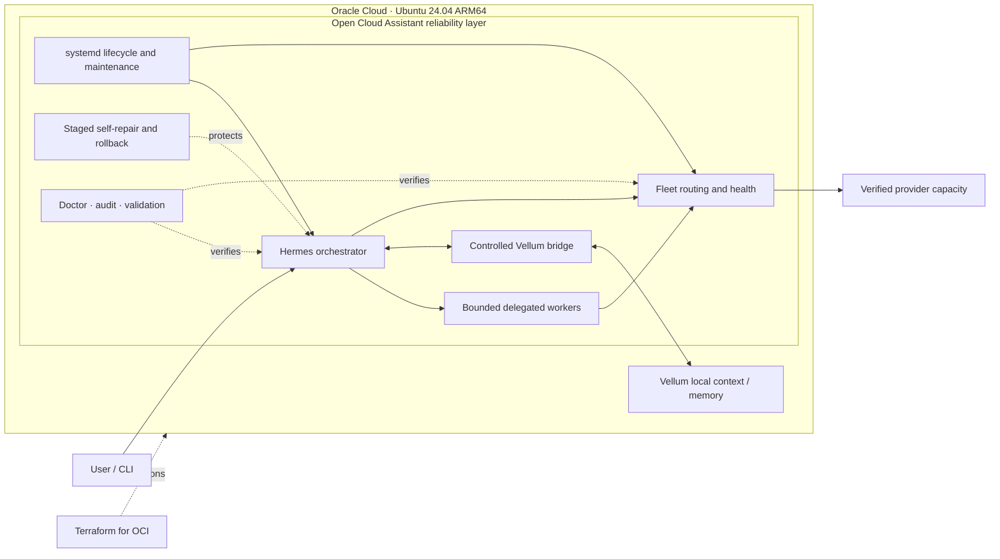
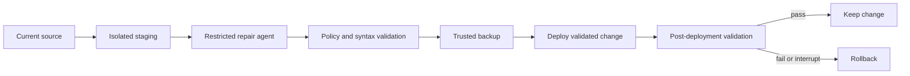

# Open Cloud Assistant

**A reliability-first cloud runtime for a persistent AI assistant.**

Open Cloud Assistant deploys and operates Hermes orchestration, Vellum local
context, and a health-aware model Fleet as one production system. It adds the
infrastructure, lifecycle controls, fault handling, isolation, and deterministic
validation needed to keep that system useful on an Ubuntu cloud host.

[](https://github.com/Mukeshkr-19/OpenCloudAssistant/actions/workflows/ci.yml)
[](https://github.com/Mukeshkr-19/OpenCloudAssistant/actions/workflows/reliability.yml)
[](docs/COMPATIBILITY.md)
[](docs/evidence/operational-snapshot-arm64.md)
[](infra/terraform/oci/README.md)
[](LICENSE)

## Engineering highlights

- **Infrastructure as Code:** Terraform-defined OCI networking, compute,
  SSH policy, cloud-init bootstrap, and optional installer handoff for Ubuntu
  24.04 ARM64.
- **Multi-worker orchestration:** Hermes can delegate independent work to
  bounded concurrent children, with machine-enforced batch outcomes and a
  bounded worker lifetime.
- **Dynamic model Fleet:** runtime discovery, compatibility verification,
  freshness checks, SQLite health history, cooldowns, session pinning, and
  bounded cross-provider fallback.
- **Controlled context delegation:** Vellum remains a separate local knowledge
  layer; restricted workers can receive allowlisted context without inheriting
  privileged repair capabilities.
- **Sandboxed repair pipeline:** staged edits, policy and syntax gates, trusted
  backups, post-deployment verification, rollback, locking, and interruption
  recovery, with Bubblewrap isolation on supported Ubuntu hosts.
- **Reliability as code:** fault injection, concurrency tests, upgrade-path
  coverage, captured-Hermes compatibility, and Ubuntu x86_64/ARM64 CI.

## Architecture

Hermes executes and coordinates work. Vellum supplies controlled local context.
Fleet selects only policy-allowed, currently verified model capacity.
Open Cloud Assistant is the reliability and lifecycle layer around all three.



The public repository contains reusable integration code, policy, tests, and
deployment tooling. Credentials, conversations, personal context, provider
registries, and runtime databases remain outside Git.

## Reliability and fault tolerance

### Strict delegated execution

Hermes uses bounded parallelism for work that benefits from independent
execution; the configured capacity is a ceiling, not a target. Provider calls
have a bounded request budget, workers have a bounded lifetime, and each worker
may cross providers at most once through a verified alternate route.

Batch completion is fail-closed. A timeout, error, interruption, cancellation,
unknown state, or missing result does **not** count as success. Every required
worker must complete successfully before the batch can be reported successful.
Delegated children receive an intersected capability set, so a restricted child
cannot regain a privileged tool excluded by its parent policy.

### Dynamic model Fleet

Fleet treats model availability as changing infrastructure rather than static
configuration:

- discovers eligible model candidates at runtime;
- verifies tool-call compatibility before production selection;
- expires verification freshness and re-probes stale entries;
- removes failed or stale candidates from production eligibility;
- records candidate and provider health in SQLite;
- applies failure-specific cooldowns and provider trip thresholds;
- serializes registry writers to prevent lost updates;
- spreads concurrent workers across verified route pools;
- preserves or invalidates session pins according to route health;
- limits worker failover to one verified alternate route.

Provider-specific routes remain in policy and operational documentation.
OpenRouter retains the stable policy route `openrouter/free`.

See [Fleet Runtime](docs/FLEET_RUNTIME.md) and
[Dynamic Fleet Registry](docs/FLEET_REGISTRY.md).

### Controlled Vellum context

Vellum is a separate local context and personal-knowledge layer, not a second
orchestrator. Hermes requests relevant context through a managed local bridge.
Restricted task profiles can expose only the read-only context operation to
delegated workers, while repair and mutation capabilities remain unavailable.

This keeps personal data outside the public repository and avoids granting
every temporary worker the full authority of the primary assistant.

See [Hermes and Vellum Integration](docs/HERMES_VELLUM.md).

## Staged self-repair

The optional repair workflow separates AI-assisted editing from trusted
deployment authority:



The trusted outer harness owns staging, validation, backup, deployment, and
rollback. A host lock prevents concurrent repairs, and a durable recovery
marker supports recovery after interruption. On supported Ubuntu systems,
Bubblewrap provides filesystem and process isolation: the live target is masked,
the normal home is replaced, and only staging plus an ephemeral sandbox home
are writable. The repair agent cannot push Git history or control production
services.

See [Self-Repair Architecture](docs/SELF_REPAIR.md) and the
[ARM64 sandbox acceptance record](docs/evidence/self-repair-sandbox-arm64.md).

## Production deployment

The validated production target is Oracle Cloud Infrastructure running Ubuntu
24.04 on ARM64/aarch64. The deployment uses:

- Terraform for the VCN, subnet, routing, security policy, compute instance,
  SSH key injection, and cloud-init;
- rerunnable installation with non-mutating dry-run and compatibility checks;
- systemd user services plus user lingering for persistent operation;
- activation-seeded Fleet registry and verifier timers;
- six-hour recurring Fleet maintenance with randomized delay;
- a runtime doctor and ownership-aware uninstall path;
- upgrade-safe preservation of Fleet registry and health state.

Production acceptance for the current release includes successful dry-run and
installation, a passing runtime doctor, healthy Hermes and Vellum integration,
Fleet timers in a schedulable waiting state with finite future triggers, and a
strict three-worker execution in which a delegated worker retrieved approved
Vellum context.

The committed operational evidence is deliberately sanitized and records
point-in-time observations rather than an uptime claim or SLO. See
[Operational Evidence](docs/evidence/README.md) and
[OCI Terraform](infra/terraform/oci/README.md).

## Validation and evidence

Pull requests exercise seven core checks across the CI and reliability
workflows:

- static privacy, credential-shape, syntax, and configuration audit;
- deterministic reliability and fault-injection suite;
- captured Hermes baseline compatibility;
- Ubuntu 24.04 smoke tests on hosted x86_64 and ARM64 runners;
- installer dry-runs on hosted x86_64 and ARM64 runners.

Repository-backed coverage includes Fleet failover and cooldown recovery,
registry freshness and stale-model rejection, SQLite writer locking, worker
route spreading and bounded fallback, strict batch outcomes, Vellum worker
state transitions, self-repair isolation and rollback, service persistence,
upgrade materialization, safe uninstall, and runtime doctor behavior.

Terraform formatting and validation run separately on hosted Ubuntu x86_64 and
ARM64 when infrastructure files change. CI validates configuration; it does not
claim to create OCI resources.

```bash
./scripts/public-audit.sh
./tests/smoke/run.sh
OPEN_CLOUD_HERMES_ROOT="$HOME/.hermes/hermes-agent" ./tests/reliability/run.sh
./bin/opencloud release check
```

Test durations are harness measurements, not provider latency or production
performance claims.

## Quick start

The supported deployment path is Ubuntu 24.04. Start with the non-mutating plan:

```bash
git clone https://github.com/Mukeshkr-19/OpenCloudAssistant.git
cd OpenCloudAssistant
./setup.sh --dry-run
OPEN_CLOUD_CHANNELS=cli ./setup.sh --install
./bin/opencloud doctor
```

Provider configuration and first-run verification are covered in the
[Complete Setup Guide](docs/COMPLETE_SETUP_GUIDE.md).

## Repository map

```text
config/                  Permanent Fleet and orchestration policy
integrations/
  fleet/                 Discovery, verification, routing, and health state
  hermes/                Orchestration and Fleet integration adapters
  vellum/                Controlled local context bridge
  self-repair/           Restricted staged-repair harness
services/systemd/        Persistent runtime and Fleet maintenance units
infra/terraform/oci/     OCI network, compute, and cloud-init definitions
install/                 Idempotent installation and upgrade stages
scripts/                 Audit, doctor, operations, and evidence tooling
tests/                    Smoke, reliability, fault-injection, and acceptance tests
docs/                     Architecture and operator documentation
```

## Documentation

- [Architecture](docs/ARCHITECTURE.md) — component responsibilities and trust boundaries
- [Complete Setup Guide](docs/COMPLETE_SETUP_GUIDE.md) — end-to-end Ubuntu deployment
- [Operations](docs/OPERATIONS.md) — health, services, logs, updates, and maintenance
- [Fleet Runtime](docs/FLEET_RUNTIME.md) and [Registry](docs/FLEET_REGISTRY.md) — routing and model lifecycle
- [Hermes and Vellum](docs/HERMES_VELLUM.md) — orchestration and controlled context
- [Self-Repair](docs/SELF_REPAIR.md) — isolation, validation, backup, and rollback
- [Always-On Services](docs/SERVICES.md) — systemd lifecycle and persistence
- [OCI Terraform](infra/terraform/oci/README.md) — infrastructure provisioning
- [Troubleshooting](docs/TROUBLESHOOTING.md) — symptom-driven recovery
- [Documentation Index](docs/README.md) — complete reference

## Status and boundaries

Ubuntu 24.04 ARM64 has real production acceptance. Hosted x86_64 CI validates
compatibility, not real-machine production operation. Provider availability is
externally variable, and the project makes no invented uptime, latency, or
scale claims.

Read [SECURITY.md](SECURITY.md) before connecting tools, personal context, or
external interfaces to an Internet-accessible host.

## Upstream and license

Open Cloud Assistant is an independent integration project built around
upstream open-source components including Hermes Agent, Vellum Assistant, and
OpenCode. Third-party components retain their own licenses; see
[Third-Party Notices](THIRD_PARTY_NOTICES.md) and [`licenses/`](licenses/).

Original Open Cloud Assistant integration, deployment, and documentation work
is released under the [MIT License](LICENSE).
