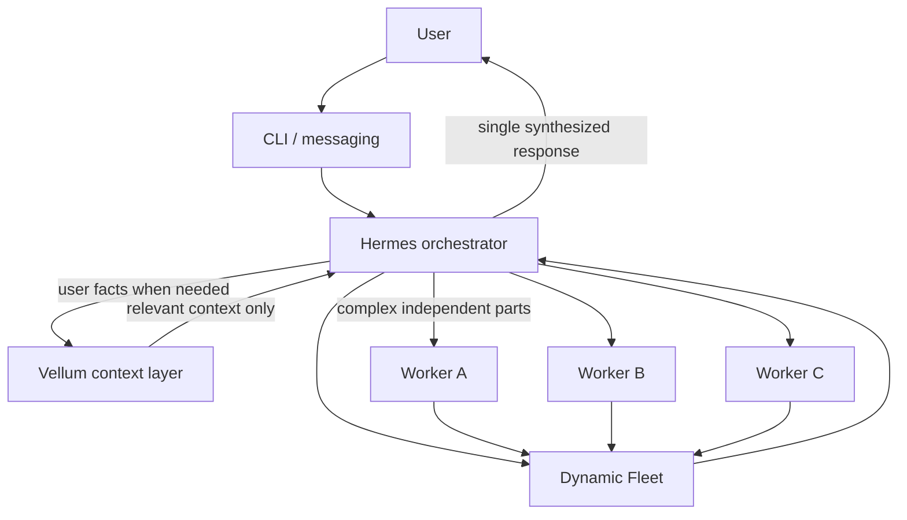
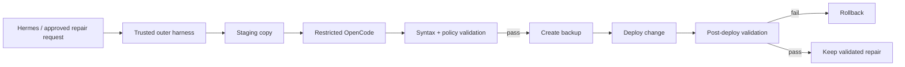

# Architecture

Open Cloud Assistant is an integration architecture, not one monolithic model process. The separation is intentional: model availability changes, user memory is sensitive, messaging is optional, and coding agents should not own deployment privileges.

## End-to-end request path



## Hermes: the only user-facing orchestrator

Hermes owns:

- conversation;
- planning and tool calls;
- messaging adapters;
- child-worker creation;
- model requests;
- final review/synthesis.

The user should not need to micromanage internal instructions such as "spawn three workers" or "use model X." The orchestrator decides when extra parallelism is justified.

## Temporary parallel workers

Canonical public orchestration policy:

```text
orchestrator_enabled = true
max_concurrent_children = 3
max_iterations = 50
max_spawn_depth = 1
inherit_mcp_toolsets = true
```

Workers are temporary executions for pieces of the **same task**. They are not persistent personas such as a permanent research agent, coding agent, and reviewer agent.

Limiting spawn depth to one prevents uncontrolled recursive agent trees while still allowing useful parallel work.

## Vellum: separate personal-context layer

Personal memory stays outside the public source repo and outside the Fleet runtime database.

The Hermes↔Vellum bridge uses two different paths:

### Read path

For ordinary questions about the user, Hermes uses deterministic:

```text
get_user_context
```

It can make one narrower retry if returned material is weak. Generic skill documentation/tool descriptions are not treated as user facts.

### Mutation path

For explicit requests such as remember/save/update/correct/forget, Hermes starts one bounded Vellum task and polls **that same task** until it completes/fails. Ordinary reads do not need the asynchronous mutation path.

Normal user replies should not expose MCP task IDs, raw JSON, internal retrieval diagnostics, or model-routing metadata.

## Dynamic Fleet

Permanent policy lives in:

```text
config/fleet/hermes-fleet-policy.json
```

Runtime state lives under:

```text
~/.local/share/hermes-fleet/
```

The architecture keeps concrete NVIDIA and Zen model IDs out of permanent public policy. Runtime discovery/verification decides which candidates are usable now.

The stable explicit OpenRouter fallback is:

```text
openrouter/free
```

Conceptual role order:

```text
main:     NVIDIA dynamic → OpenRouter free → Gemini emergency (blocked)
worker:   Zen free dynamic → NVIDIA dynamic → OpenRouter free → Gemini emergency (blocked)
reviewer: NVIDIA dynamic → OpenRouter free → Gemini emergency (blocked)
```

The dispatcher tracks model/provider health and cooldowns. Failure switching is internal control flow; normal conversation should receive one clean answer rather than provider-debug narration.

## Gemini guard

Fleet discovery and Fleet permission are separate concerns. The generic dispatcher can understand that a provider exists, but the Hermes integration can still forbid routing to it.

v0.1.0 keeps Gemini blocked until independently verified.

## Restricted self-repair



The coding model does **not** own Git push, production service control, secret files, or broad filesystem/network access. It edits a staging copy under restricted tool permissions. The outer harness performs validation, backup, deployment, and rollback.

The public repair workflow does not automatically commit/push Git or restart Hermes.

## Service architecture

Open Cloud Assistant uses systemd user services/timers.

Always installed for Fleet maintenance:

```text
hermes-fleet-registry.timer
hermes-fleet-verifier.timer
```

Hermes gateway is required when Telegram, Discord, advanced messaging, or iMessage is selected. CLI-only does not require the gateway.

User-service linger enables boot persistence without an interactive login.

## Channel separation

Channels are interfaces, not the brain.

- CLI is the universal baseline.
- Telegram/Discord add cross-platform messaging.
- Browser preview prepares a protected localhost API configuration but is not a release-validated browser service yet.
- iMessage remains optional.

Changing the channel should not create a second memory system or a second orchestrator.

## Privacy boundaries

Never commit:

- provider credentials;
- bot tokens;
- personal memory/context;
- Vellum task/runtime state;
- conversations;
- Fleet runtime databases/registries;
- auth/session state;
- SSH keys;
- private production logs.

Source Git should contain reusable code, policy, tests, documentation, and sanitized integration references only.

## Why routine lifecycle notices are hidden

Gateway restart/shutdown and provider failover are internal lifecycle events. The deployment suppresses routine user-facing gateway lifecycle notices by default while keeping:

- hard interruption behavior;
- resume/recovery state;
- systemd logs;
- adapter teardown/reconnect;
- actual model fallback.

Operators can opt back into upstream gateway lifecycle notices with:

```text
HERMES_GATEWAY_LIFECYCLE_NOTICES=1
```
